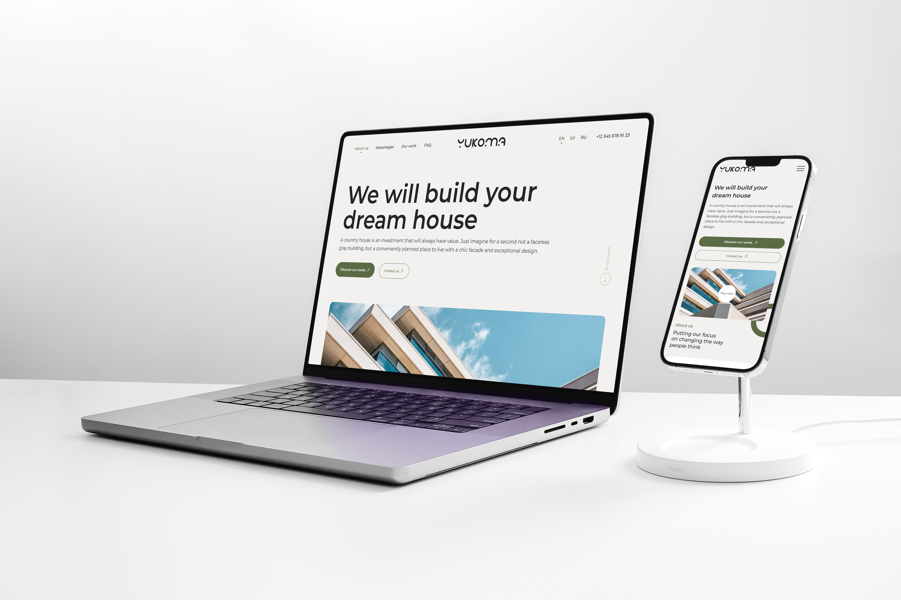

# 🏡 Yukoma - многостраничный HTML‑сайт

Проект **Yukoma** - это адаптивный многостраничный сайт, реализованный с использованием чистого HTML, CSS и JavaScript.  
Сайт корректно отображается на всех современных устройствах и браузерах и размещён на GitHub Pages.

---

## 🔗 Ссылки

📌 **Live preview (главная страница):**  
👉https://wlad96.github.io/yukoma/main.html

📌 **Preview всех страниц:**  
👉https://wlad96.github.io/yukoma/

📦 **GitHub репозиторий:**  
👉https://github.com/wlad96/yukoma

🎨 **Figma дизайн:**  
👉https://www.figma.com/design/7mt0URVHibKrDAxLhqRh9r/YUKOMA?node-id=0-1&t=P7nD9qHFVTPiVkmV-1

---

## 🖼 Preview

---

## 🛠 Используемые технологии

- **HTML5** - семантическая многостраничная разметка  
- **CSS3** - адаптивная вёрстка, Flexbox, Grid, media queries  
- **JavaScript (Vanilla JS)** - интерактивные элементы  
- **Responsive Design** - поддержка desktop / tablet / mobile  
- **GitHub Pages** - деплой и live preview  

---

## 📄 Страницы сайта

Проект включает **4 страницы**:

- Main page - главная страница  
- About page - информация о компании  
- Projects / Services page - услуги или проекты  
- Contacts page - контактная информация  

Все страницы доступны через общую навигацию.

---

## ✨ Особенности

- Многостраничная структура  
- Чистая и семантическая верстка  
- Полная адаптация под мобильные устройства  
- Простая и понятная навигация  
- Подходит для портфолио
